# 🎯 AI Semester 6 — Unit Test 2 (PT-II) Complete Preparation Guide
## Mumbai University | Computer Engineering | REV-2019 C-Scheme

---

# 📊 PART A: QUESTION BANK ANALYSIS & PAST TREND PATTERNS

## Exam Format (PT-II / Class Test 2)
| Parameter | Detail |
|-----------|--------|
| **Total Marks** | 20 Marks |
| **Duration** | 1 Hour |
| **Syllabus Coverage** | Modules 4, 5, 6 (approx. 40-80% of syllabus) |
| **Question Style** | Mix of theory + numerical + application-based |

---

## 🔥 Topic-Wise Priority Analysis (Based on MU Past Trends)

| Priority | Topic | Questions | Frequency in MU Exams | Expected Marks |
|----------|-------|-----------|----------------------|----------------|
| 🔴 **HIGHEST** | Alpha-Beta Pruning (Numerical) | Q1 | **Almost Every Exam** — numerical is guaranteed | 5-10 marks |
| 🔴 **HIGHEST** | Resolution / CNF Conversion | Q7, Q8, Q9 | **Every Exam** — core numerical topic | 5-10 marks |
| 🟠 **HIGH** | Forward & Backward Chaining | Q4, Q5, Q6, Q9 | **Very Frequent** — theory + example | 5-10 marks |
| 🟠 **HIGH** | FOL Conversion | Q2, Q3 | **Very Frequent** — conversion questions | 5 marks |
| 🟡 **MEDIUM** | Planning (Total + Partial Order) | Q10, Q11 | **Frequent** — theory-based | 5 marks |
| 🟢 **STANDARD** | Propositional Logic vs FOL | Q3 | **Frequent** — comparison table | 5 marks |
| 🟢 **STANDARD** | Applications of AI | Q12 | **Moderate** — easy marks | 5 marks |
| 🔵 **LOW-MED** | NLP | Q13 | **Occasional** — short note type | 5 marks |
| 🔵 **LOW-MED** | Types of Learning | Q14 | **Occasional** — short note type | 5 marks |

---

## 📈 Pattern Classification of Questions

### Pattern 1: Numerical / Problem-Solving (MOST IMPORTANT — Practice These!)
| Q# | Topic | Type |
|----|-------|------|
| Q1 | Alpha-Beta Pruning | Draw tree, show α/β values, prune |
| Q8 | CNF Conversion + Resolution | Step-by-step conversion & proof |
| Q9 | Prove using Forward/Backward Chaining/Resolution | Apply algorithm on given KB |

### Pattern 2: Concept + Example (Theory with Worked Example)
| Q# | Topic | Type |
|----|-------|------|
| Q2 | Convert statements to FOL | Translation exercise |
| Q4 | Forward Chaining | Explain algorithm + example |
| Q5 | Backward Chaining | Explain algorithm + example |
| Q7 | Resolution steps with CNF | Algorithmic steps + example |
| Q10 | Total Order Planning | Explain + example |
| Q11 | Partial Order Planning | Explain + example |

### Pattern 3: Compare & Contrast (Table-based answers score highest)
| Q# | Topic | Type |
|----|-------|------|
| Q3 | Propositional Logic vs FOL | Comparison table |
| Q6 | Forward vs Backward Chaining | Comparison table |

### Pattern 4: Short Notes / Descriptive
| Q# | Topic | Type |
|----|-------|------|
| Q12 | Applications of AI | List with brief explanations |
| Q13 | NLP | Definition + components |
| Q14 | Types of Learning | Classification + brief explanation |

> [!TIP]
> **Exam Strategy**: Always attempt numerical questions (Pattern 1) first — they carry the most marks and demonstrate understanding. Use **diagrams and tables** wherever possible — MU examiners award extra marks for visual presentation.

---

# 📝 PART B: COMPLETE ANSWERS FOR MAXIMUM MARKS

---

## Q1) Alpha-Beta Pruning — Find the Value of Root Node

### Definition
Alpha-Beta Pruning is an **optimization technique** applied to the **Minimax algorithm** to reduce the number of nodes evaluated in a game tree. It prunes branches that **cannot possibly influence** the final decision.

### Key Concepts

| Term | Meaning |
|------|---------|
| **α (Alpha)** | Best value the **Maximizer** can guarantee (initially −∞) |
| **β (Beta)** | Best value the **Minimizer** can guarantee (initially +∞) |
| **Pruning Condition** | Prune when **α ≥ β** |
| **MAX node** | Updates α = max(α, child value) |
| **MIN node** | Updates β = min(β, child value) |

### Algorithm Steps
1. Start from the root with **α = −∞**, **β = +∞**
2. At a **MAX node**: evaluate children left-to-right, update **α = max(α, child_value)**
   - If **α ≥ β** → **PRUNE** remaining children (β-cutoff)
3. At a **MIN node**: evaluate children left-to-right, update **β = min(β, child_value)**
   - If **α ≥ β** → **PRUNE** remaining children (α-cutoff)
4. Propagate values back up the tree

### Worked Example

Consider the following game tree:

```
                        MAX (Root)
                       /          \
                    MIN            MIN
                   /   \          /   \
                 MAX   MAX     MAX    MAX
                / \    / \    / \    / \
               3   5  6   9  1   2  0   -1
```

**Step-by-step Solution:**

```
Step 1: Start at Root (MAX), α = -∞, β = +∞
        Go to left MIN node, α = -∞, β = +∞

Step 2: Left MIN → Left MAX node, α = -∞, β = +∞
        Evaluate leaf 3: α = max(-∞, 3) = 3
        Evaluate leaf 5: α = max(3, 5) = 5
        MAX node returns 5

Step 3: Left MIN node receives 5
        β = min(+∞, 5) = 5
        Go to Right MAX node, α = -∞, β = 5

Step 4: Right MAX → Evaluate leaf 6: α = max(-∞, 6) = 6
        CHECK: α(6) ≥ β(5)? YES! → ✂️ PRUNE leaf 9
        Right MAX returns 6 (but MIN will use 5)

Step 5: Left MIN node: β = min(5, 6) = 5
        Left MIN returns 5

Step 6: Root (MAX) receives 5
        α = max(-∞, 5) = 5
        Go to Right MIN node, α = 5, β = +∞

Step 7: Right MIN → Left MAX node, α = 5, β = +∞
        Evaluate leaf 1: α = max(5, 1) = 5
        Evaluate leaf 2: α = max(5, 2) = 5
        Left MAX returns 2

Step 8: Right MIN receives 2
        β = min(+∞, 2) = 2
        CHECK: α(5) ≥ β(2)? YES! → ✂️ PRUNE entire Right MAX subtree (0, -1)

Step 9: Right MIN returns 2

Step 10: Root (MAX): value = max(5, 2) = 5
         ★ ROOT VALUE = 5
```

### Diagram — Alpha-Beta Pruning Tree

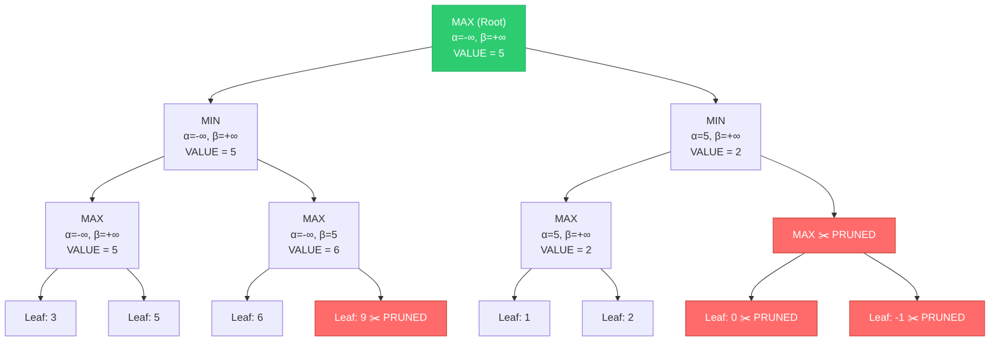

### Properties of Alpha-Beta Pruning

| Property | Value |
|----------|-------|
| **Completeness** | Yes (same result as Minimax) |
| **Optimality** | Yes (does not change the final decision) |
| **Time (Best Case)** | O(b^(d/2)) — effectively doubles searchable depth |
| **Time (Worst Case)** | O(b^d) — same as Minimax (no pruning) |
| **Space Complexity** | O(bd) |

> [!IMPORTANT]
> **Drawing Tips for Exam**: Always draw the tree neatly, label each node with α and β values, cross out pruned nodes with ✂️, and clearly write the final root value. Show step numbers.

---

## Q2) Convert Statements to First-Order Logic (FOL)

### Key FOL Symbols

| Symbol | Meaning | Example |
|--------|---------|---------|
| ∀ | For all (Universal) | ∀x: "for every x" |
| ∃ | There exists (Existential) | ∃x: "there exists an x" |
| → | Implies | P → Q: "if P then Q" |
| ∧ | AND | P ∧ Q: "P and Q" |
| ∨ | OR | P ∨ Q: "P or Q" |
| ¬ | NOT | ¬P: "not P" |
| Predicates | Properties/Relations | Loves(x, y), Dog(x) |
| Functions | Mappings | Father(x), MotherOf(x) |

### Conversion Rules (Step-by-Step Method)

1. **Identify objects** → constants (e.g., John, Mary)
2. **Identify properties** → unary predicates (e.g., Human(x), Dog(x))
3. **Identify relations** → n-ary predicates (e.g., Loves(x,y), Teaches(x,y))
4. **Identify quantifiers** → "all" = ∀, "some/there exists" = ∃
5. **"All A are B"** → ∀x [A(x) → B(x)] *(use → with ∀)*
6. **"Some A are B"** → ∃x [A(x) ∧ B(x)] *(use ∧ with ∃)*

### Common Examples

| # | English Statement | FOL Representation |
|---|-------------------|--------------------|
| 1 | "Every human is mortal" | ∀x [Human(x) → Mortal(x)] |
| 2 | "Some students are intelligent" | ∃x [Student(x) ∧ Intelligent(x)] |
| 3 | "John loves Mary" | Loves(John, Mary) |
| 4 | "Every dog has a tail" | ∀x [Dog(x) → Has(x, Tail)] |
| 5 | "Not all birds can fly" | ¬∀x [Bird(x) → CanFly(x)] <br/>OR ∃x [Bird(x) ∧ ¬CanFly(x)] |
| 6 | "Everyone who loves someone is happy" | ∀x [∃y Loves(x,y) → Happy(x)] |
| 7 | "No student likes exam" | ∀x [Student(x) → ¬Likes(x, Exam)] <br/>OR ¬∃x [Student(x) ∧ Likes(x, Exam)] |
| 8 | "There is a person who loves everyone" | ∃x [Person(x) ∧ ∀y [Person(y) → Loves(x,y)]] |
| 9 | "All that glitters is not gold" | ∀x [Glitters(x) → ¬Gold(x)] |
| 10 | "Marcus is a man" | Man(Marcus) |
| 11 | "Marcus is a Pompeian" | Pompeian(Marcus) |
| 12 | "All Pompeians are Romans" | ∀x [Pompeian(x) → Roman(x)] |
| 13 | "Caesar is a ruler" | Ruler(Caesar) |
| 14 | "All Romans were loyal to Caesar or hated him" | ∀x [Roman(x) → Loyal(x, Caesar) ∨ Hates(x, Caesar)] |

> [!WARNING]
> **Common Mistake**: With ∀, always use **→** (implication), NOT ∧. With ∃, always use **∧** (conjunction), NOT →. This is the #1 error students make!

---

## Q3) Compare and Contrast: Propositional Logic vs First-Order Logic (FOL)

### Comparison Table

| Parameter | Propositional Logic (PL) | First-Order Logic (FOL) |
|-----------|-------------------------|------------------------|
| **Also Called** | Boolean Logic / Sentential Logic | Predicate Logic / First-Order Predicate Calculus (FOPC) |
| **Basic Unit** | Propositions (P, Q, R) — simple true/false statements | Predicates with arguments — P(x), Q(x,y) |
| **Variables** | ❌ Not supported | ✅ Supported (x, y, z) |
| **Quantifiers** | ❌ Not available | ✅ ∀ (universal), ∃ (existential) |
| **Objects** | ❌ Cannot represent individual objects | ✅ Can represent objects, properties, relations |
| **Functions** | ❌ No functions | ✅ Functions supported (Father(x), MotherOf(y)) |
| **Expressive Power** | 🔸 Limited — can only represent facts as true/false | 🔹 High — can express complex relationships and generalizations |
| **Connectives** | ∧, ∨, ¬, →, ↔ | ∧, ∨, ¬, →, ↔ (same) + ∀, ∃ |
| **Example** | "It is raining" → P | "It is raining in Mumbai" → Raining(Mumbai) |
| **Generalization** | Cannot say "All X are Y" | ∀x [X(x) → Y(x)] |
| **Complexity** | Decidable (always terminates) | Semi-decidable |
| **Inference** | Resolution, Truth Table, Forward/Backward Chaining | Resolution, Unification, Forward/Backward Chaining |
| **Use Case** | Simple boolean circuits, basic reasoning | AI knowledge bases, databases, expert systems |

### Examples

**Propositional Logic:**
```
P: "It is raining"
Q: "I carry an umbrella"
Rule: P → Q  (If it is raining, then I carry an umbrella)
```

**First-Order Logic:**
```
∀x [Student(x) ∧ Studies(x) → Passes(x)]
"For every x, if x is a student and x studies, then x passes"
```
→ FOL can express **who** does **what** — PL cannot.

### Diagram — Expressiveness Comparison

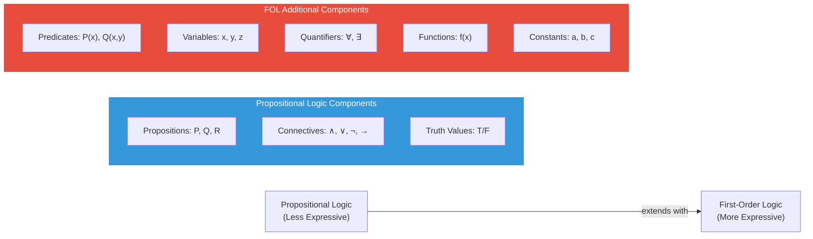

---

## Q4) Forward Chaining — Explanation with Example

### Definition
Forward Chaining is a **data-driven** inference method that starts from **known facts** in the knowledge base and applies inference rules to derive **new facts** until the **goal is reached** or no more rules can fire.

### Key Characteristics
- **Direction**: Facts → Goal (**bottom-up** reasoning)
- **Strategy**: Data-driven / Event-driven
- **Process**: Starts with available data, fires applicable rules, adds new facts
- **Termination**: When goal is found OR no new facts can be derived

### Algorithm Steps
1. Start with the initial set of **known facts** in the knowledge base (KB)
2. Check all rules — find rules whose **premises (conditions)** are all satisfied
3. **Fire** the rule — add the **conclusion** to the KB as a new fact
4. Repeat Steps 2-3 until:
   - The **goal** is derived ✅
   - No more new facts can be derived ❌

### Worked Example

**Knowledge Base (Rules):**
```
R1: If A and B then C         (A ∧ B → C)
R2: If C and D then E         (C ∧ D → E)
R3: If A and E then F         (A ∧ E → F)
R4: If F then G               (F → G)
```

**Known Facts:** A, B, D  
**Goal:** Prove G

**Forward Chaining Execution:**

| Iteration | Known Facts | Rule Fired | New Fact Added |
|-----------|-------------|------------|----------------|
| 1 | {A, B, D} | R1 (A ∧ B → C) | **C** |
| 2 | {A, B, D, C} | R2 (C ∧ D → E) | **E** |
| 3 | {A, B, D, C, E} | R3 (A ∧ E → F) | **F** |
| 4 | {A, B, D, C, E, F} | R4 (F → G) | **G** ✅ Goal Reached! |

**Result:** G is proved! ✅

### Diagram — Forward Chaining Flow

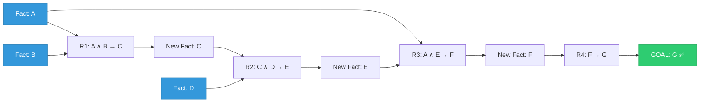

### Advantages & Disadvantages

| Advantages | Disadvantages |
|------------|---------------|
| Simple to implement | May derive irrelevant facts (unfocused) |
| Good when many inputs trigger few conclusions | Can be slow if KB is large |
| Natural for monitoring/diagnostic systems | No control over which facts to derive |
| Works well with real-time data | May generate unnecessary intermediate facts |

---

## Q5) Backward Chaining — Explanation with Example

### Definition
Backward Chaining is a **goal-driven** inference method that starts from the **goal** and works **backward** through rules to find if the known facts support the goal.

### Key Characteristics
- **Direction**: Goal → Facts (**top-down** reasoning)
- **Strategy**: Goal-driven / Query-driven
- **Process**: Starts with goal, finds rules that conclude the goal, checks if premises are facts
- **Termination**: When all sub-goals are matched to known facts ✅ or no rule can prove a sub-goal ❌

### Algorithm Steps
1. Start with the **goal** to prove
2. Find all rules whose **conclusion matches** the goal
3. Check the **premises** of such rules:
   - If a premise is a **known fact** → satisfied ✅
   - If a premise is **not a known fact** → set it as a **new sub-goal** and recurse (Go to Step 2)
4. If **all premises** of at least one rule are satisfied → Goal is **proved** ✅
5. If **no rule** can prove the goal → Goal **fails** ❌

### Worked Example

**Knowledge Base (Rules):**
```
R1: A ∧ B → C
R2: C ∧ D → E
R3: A ∧ E → F
R4: F → G
```

**Known Facts:** A, B, D  
**Goal:** Prove G

**Backward Chaining Execution:**

```
Goal: G
├── R4: F → G  ∴ Need to prove F
│   ├── R3: A ∧ E → F  ∴ Need to prove A and E
│   │   ├── A → Known Fact ✅
│   │   └── E → Not a fact, need to prove E
│   │       ├── R2: C ∧ D → E  ∴ Need to prove C and D
│   │       │   ├── D → Known Fact ✅
│   │       │   └── C → Not a fact, need to prove C
│   │       │       ├── R1: A ∧ B → C  ∴ Need to prove A and B
│   │       │       │   ├── A → Known Fact ✅
│   │       │       │   └── B → Known Fact ✅
│   │       │       └── C is PROVED ✅
│   │       └── E is PROVED ✅
│   └── F is PROVED ✅
└── G is PROVED ✅ 🎉
```

### Diagram — Backward Chaining Flow

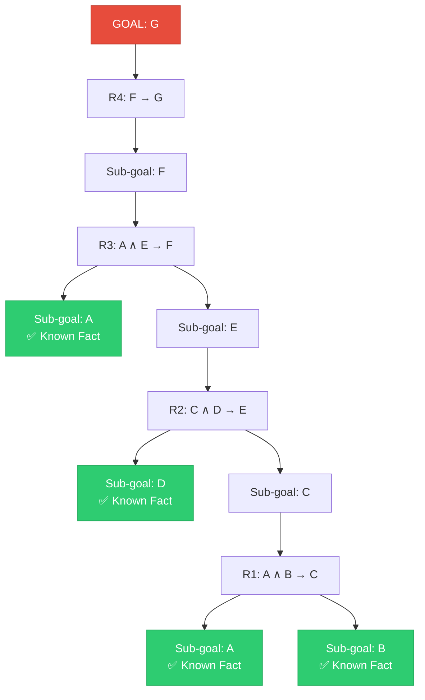

### Advantages & Disadvantages

| Advantages | Disadvantages |
|------------|---------------|
| Focused — only explores relevant rules | May get stuck in infinite loops |
| Efficient when goal is known | Not suitable for monitoring systems |
| Works like hypothesis testing | Needs a specific goal to start |
| Used in expert systems (e.g., MYCIN) | May miss alternative solutions |

---

## Q6) Compare and Contrast: Forward Chaining vs Backward Chaining

### Comparison Table

| Parameter | Forward Chaining | Backward Chaining |
|-----------|-----------------|-------------------|
| **Also Called** | Data-driven reasoning | Goal-driven reasoning |
| **Direction** | Facts → Goal (Bottom-up) | Goal → Facts (Top-down) |
| **Starts With** | Known facts in KB | Goal to be proved |
| **Strategy** | Fire all applicable rules | Find rules that conclude goal |
| **Search** | Breadth-first like | Depth-first like |
| **Efficiency** | May derive unnecessary facts | Only explores relevant paths |
| **Best When** | Many inputs, few known goals | Specific goal to verify |
| **Termination** | Goal reached or no new facts | All sub-goals matched or fail |
| **Example System** | CLIPS, Business Rule Engines | Prolog, MYCIN Expert System |
| **Analogy** | Detective collecting evidence | Doctor diagnosing disease |
| **Control** | Less control (explores broadly) | More control (focused) |
| **Real-time Data** | ✅ Good for streaming data | ❌ Not ideal |
| **Complexity** | Can be wasteful | More efficient for targeted queries |

### Diagram — Comparison

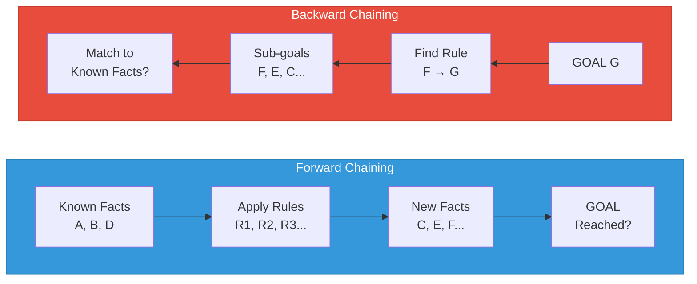

### Example of Each

**Forward Chaining Example:**
- **Scenario**: Fire alarm system
- Facts: Smoke detected, Temperature > 100°C
- Rule: Smoke ∧ HighTemp → Fire
- Forward chain derives: **Fire alarm triggered!**

**Backward Chaining Example:**
- **Scenario**: Medical diagnosis
- Goal: Does patient have Flu?
- Rule: Fever ∧ Cough ∧ BodyAche → Flu
- Backward chain asks: Does patient have Fever? Cough? BodyAche?

---

## Q7) Resolution — Steps for Converting to CNF with Example

### Definition
**Resolution** is a **proof by contradiction** (refutation) technique. It converts all sentences to **Conjunctive Normal Form (CNF)**, negates the goal, and applies the **resolution rule** to derive an **empty clause (contradiction)**, thereby proving the original goal.

### Steps to Convert to CNF (Conjunctive Normal Form)

| Step | Operation | Example |
|------|-----------|---------|
| **Step 1** | **Eliminate Biconditional (↔)** | P ↔ Q becomes (P → Q) ∧ (Q → P) |
| **Step 2** | **Eliminate Implication (→)** | P → Q becomes ¬P ∨ Q |
| **Step 3** | **Move Negation Inward (De Morgan's)** | ¬(P ∧ Q) = ¬P ∨ ¬Q; ¬(P ∨ Q) = ¬P ∧ ¬Q |
| **Step 4** | **Remove Double Negation** | ¬¬P = P |
| **Step 5** | **Standardize Variables** (FOL) | Rename variables so each quantifier uses a unique variable |
| **Step 6** | **Skolemize** (FOL) | Remove ∃ by replacing with Skolem constants/functions |
| **Step 7** | **Drop Universal Quantifiers** (FOL) | Remove ∀ (all remaining variables are implicitly universally quantified) |
| **Step 8** | **Distribute ∨ over ∧** | A ∨ (B ∧ C) = (A ∨ B) ∧ (A ∨ C) |
| **Step 9** | **Write as set of clauses** | Each conjunct is a separate clause |

### Resolution Rule

```
Clause 1: A ∨ B
Clause 2: ¬B ∨ C
─────────────────
Resolvent:  A ∨ C     (B and ¬B cancel out — complementary literals)
```

### Worked Example

**Given Sentences:**
1. "If it rains, the ground is wet" → Rain → Wet
2. "If the ground is wet, it is slippery" → Wet → Slippery
3. "It is raining" → Rain

**Goal: Prove "It is slippery"** → Prove: Slippery

**Step-by-Step Resolution:**

**Step 1: Convert to CNF**
```
S1: Rain → Wet    ⟹  ¬Rain ∨ Wet
S2: Wet → Slippery ⟹  ¬Wet ∨ Slippery
S3: Rain           ⟹  Rain
```

**Step 2: Negate the goal**
```
S4: ¬Slippery  (negation of what we want to prove)
```

**Step 3: List all clauses**
```
C1: ¬Rain ∨ Wet
C2: ¬Wet ∨ Slippery
C3: Rain
C4: ¬Slippery
```

**Step 4: Apply Resolution**
```
C2 + C4:  (¬Wet ∨ Slippery) + (¬Slippery)
          Resolve on: Slippery/¬Slippery
          ─────────────────────────────
C5:       ¬Wet

C1 + C5:  (¬Rain ∨ Wet) + (¬Wet)
          Resolve on: Wet/¬Wet
          ─────────────────────────────
C6:       ¬Rain

C3 + C6:  (Rain) + (¬Rain)
          Resolve on: Rain/¬Rain
          ─────────────────────────────
C7:       □ (EMPTY CLAUSE — CONTRADICTION!)
```

**★ Contradiction derived → Original goal "Slippery" is PROVED! ✅**

### Diagram — Resolution Proof Tree

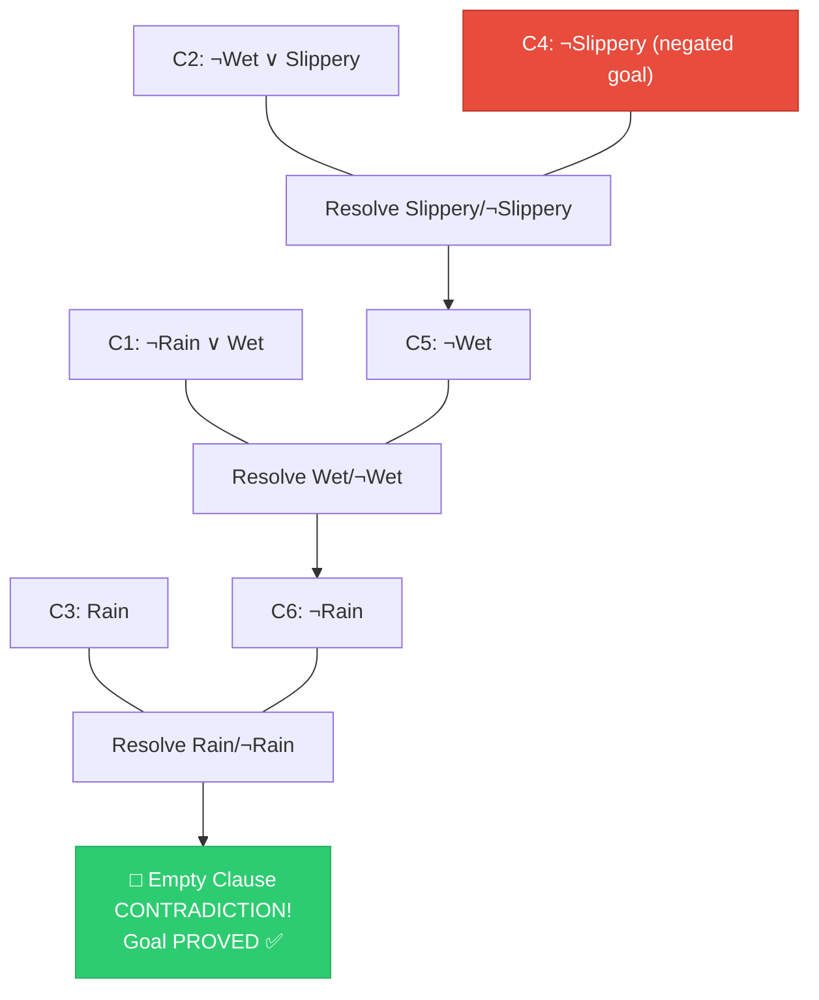

---

## Q8) Convert to CNF and Resolve — Detailed Method

### Comprehensive Example

**Given Statements:**
1. "All men are mortal" → ∀x [Man(x) → Mortal(x)]
2. "Socrates is a man" → Man(Socrates)

**Prove:** "Socrates is mortal" → Mortal(Socrates)

**Step 1: Eliminate Implication**
```
S1: ∀x [Man(x) → Mortal(x)]
    = ∀x [¬Man(x) ∨ Mortal(x)]
```

**Step 2: Drop Universal Quantifier**
```
S1: ¬Man(x) ∨ Mortal(x)
S2: Man(Socrates)
```

**Step 3: Negate the Goal**
```
S3: ¬Mortal(Socrates)
```

**Step 4: List Clauses**
```
C1: ¬Man(x) ∨ Mortal(x)
C2: Man(Socrates)
C3: ¬Mortal(Socrates)
```

**Step 5: Apply Resolution with Unification**
```
C1 + C3: Unify Mortal(x) with Mortal(Socrates) → {x/Socrates}
         (¬Man(Socrates) ∨ Mortal(Socrates)) + (¬Mortal(Socrates))
         Resolve on Mortal(Socrates)
         ─────────────────────────────
C4:      ¬Man(Socrates)

C2 + C4: (Man(Socrates)) + (¬Man(Socrates))
         Resolve on Man(Socrates)
         ─────────────────────────────
C5:      □ EMPTY CLAUSE → CONTRADICTION!
```

**★ "Socrates is mortal" is PROVED! ✅**

### Key Points for Exam
- Always show **unification substitution** {x/Socrates} clearly
- Negate the goal **before** starting resolution
- Number your clauses (C1, C2, ...) for clarity
- Draw the resolution tree if asked

---

## Q9) Prove a Sentence Using Forward/Backward Chaining or Resolution

### Multi-Method Approach Example

**Knowledge Base:**
```
R1: P ∧ Q → R
R2: R ∧ S → T
R3: T → U
```
**Facts:** P, Q, S  
**Prove:** U

---

### Method 1: Forward Chaining

| Step | Facts | Rule Applied | New Fact |
|------|-------|-------------|----------|
| 1 | {P, Q, S} | R1: P ∧ Q → R | R |
| 2 | {P, Q, S, R} | R2: R ∧ S → T | T |
| 3 | {P, Q, S, R, T} | R3: T → U | **U ✅** |

**U is proved!**

---

### Method 2: Backward Chaining

```
Goal: U
└── R3: T → U → Need T
    └── R2: R ∧ S → T → Need R and S
        ├── S → Known ✅
        └── R → Need R
            └── R1: P ∧ Q → R → Need P and Q
                ├── P → Known ✅
                └── Q → Known ✅
            ∴ R proved ✅
        ∴ T proved ✅
    ∴ U proved ✅
```

---

### Method 3: Resolution

**CNF Conversion:**
```
C1: ¬P ∨ ¬Q ∨ R      (from P ∧ Q → R)
C2: ¬R ∨ ¬S ∨ T      (from R ∧ S → T)
C3: ¬T ∨ U            (from T → U)
C4: P                  (fact)
C5: Q                  (fact)
C6: S                  (fact)
C7: ¬U                 (negated goal)
```

**Resolution Steps:**
```
C3 + C7: (¬T ∨ U) + (¬U) = ¬T → C8
C2 + C8: (¬R ∨ ¬S ∨ T) + (¬T) = ¬R ∨ ¬S → C9
C6 + C9: (S) + (¬R ∨ ¬S) = ¬R → C10
C1 + C10: (¬P ∨ ¬Q ∨ R) + (¬R) = ¬P ∨ ¬Q → C11
C5 + C11: (Q) + (¬P ∨ ¬Q) = ¬P → C12
C4 + C12: (P) + (¬P) = □ (Empty Clause!) → PROVED ✅
```

> [!TIP]
> **Exam Tip**: If the question says "prove using any method," use Forward Chaining first (it's the simplest). If it says "using resolution," you must show CNF conversion steps.

---

## Q10) Total Order Planning

### Definition
Total Order Planning (also called **Linear Planning**) generates a plan where **all actions are arranged in a strict, complete sequential order**. Every action has a fixed position — there is exactly **one linear sequence** from start to goal.

### Key Characteristics
- Actions are ordered in a **single linear sequence** (A₁ → A₂ → A₃ → ...)
- Every pair of actions has a defined order (either Aᵢ before Aⱼ or Aⱼ before Aᵢ)
- Simple but may be **inflexible** and suboptimal
- Uses **state-space search** (forward or backward)

### STRIPS Representation
Each action is described by:
- **Preconditions**: What must be true before the action
- **Add List (Effects+)**: Facts that become true after the action
- **Delete List (Effects−)**: Facts that become false after the action

### Worked Example — Blocks World

**Problem:**
```
Initial State: A is on Table, B is on Table, C is on A
Goal State:    A is on B, B is on C, C is on Table
```

```
Initial:     Goal:
  [C]          [A]
  [A]          [B]
  [B]          [C]
─────── ──   ───────
 Table        Table
```

**Actions Available:**
```
Move(x, y, z): Move block x from y to z
  Preconditions: On(x,y), Clear(x), Clear(z)
  Add: On(x,z), Clear(y)
  Delete: On(x,y), Clear(z)

MoveToTable(x, y): Move block x from y to Table
  Preconditions: On(x,y), Clear(x)
  Add: On(x,Table), Clear(y)
  Delete: On(x,y)
```

**Total Order Plan (Strict Sequence):**

| Step | Action | State After |
|------|--------|-------------|
| 1 | MoveToTable(C, A) | A on Table, B on Table, C on Table; Clear(A), Clear(B), Clear(C) |
| 2 | Move(B, Table, C) | A on Table, B on C, C on Table; Clear(A), Clear(B) |
| 3 | Move(A, Table, B) | **A on B, B on C, C on Table** ✅ GOAL! |

### Diagram — Total Order Plan

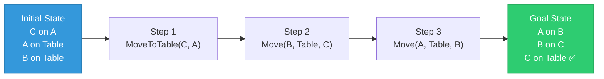

### Advantages & Disadvantages

| Advantages | Disadvantages |
|------------|---------------|
| Simple to understand and implement | Over-constrains the plan (unnecessary ordering) |
| Easy to execute (just follow sequence) | May miss opportunities for parallel actions |
| Deterministic output | Can be inefficient for complex problems |
| Good for simple planning problems | Susceptible to the **Sussman Anomaly** |

---

## Q11) Partial Order Planning (POP)

### Definition
Partial Order Planning generates a plan where only **necessary ordering constraints** are specified between actions. Actions that are **independent** can be executed in **any order or in parallel**.

### Key Characteristics
- Only orders actions when there is a **causal dependency**
- Uses **least commitment strategy** — delays ordering decisions
- Represents plan as a **Directed Acyclic Graph (DAG)**, not a linear sequence
- Can handle problems where total-order planning fails (e.g., Sussman Anomaly)

### Key Components of a Partial Order Plan

| Component | Description |
|-----------|-------------|
| **Actions** | Set of steps in the plan |
| **Ordering Constraints** | A < B means "A must come before B" |
| **Causal Links** | A ---p--→ B means "A achieves precondition p for B" |
| **Open Preconditions** | Preconditions not yet satisfied by any action |
| **Threats** | Actions that may undo a causal link |

### Algorithm (POP Algorithm)
1. Start with **initial plan**: Start action + Finish action
2. Pick an **open precondition** p of some action B
3. Find or add an action A that **achieves** p
4. Add **ordering constraint** A < B
5. Add **causal link** A --p-→ B
6. **Resolve threats**: If any action C threatens the causal link:
   - **Promotion**: Add C < A (put C before A)
   - **Demotion**: Add B < C (put C after B)
7. Repeat until **no open preconditions** remain

### Worked Example — Blocks World (Same Problem)

```
Plan with Partial Ordering:

  Start
  /    \
 v      v
MoveToTable(C,A)    (no dependency between future Move steps initially)
 |
 v
Move(B, Table, C)   ← needs Clear(C), which MoveToTable(C,A) provides
 |
 v
Move(A, Table, B)   ← needs Clear(B), which Step 2 affects
 |
 v
Finish
```

**Ordering Constraints:**
- Start < MoveToTable(C,A) < Move(B,Table,C) < Move(A,Table,B) < Finish

**Causal Links:**
- Start --On(C,A)-→ MoveToTable(C,A)
- MoveToTable(C,A) --Clear(A)-→ Move(A,Table,B)
- MoveToTable(C,A) --On(C,Table)-→ (available for Move(B,Table,C))

### Diagram — Partial Order Plan

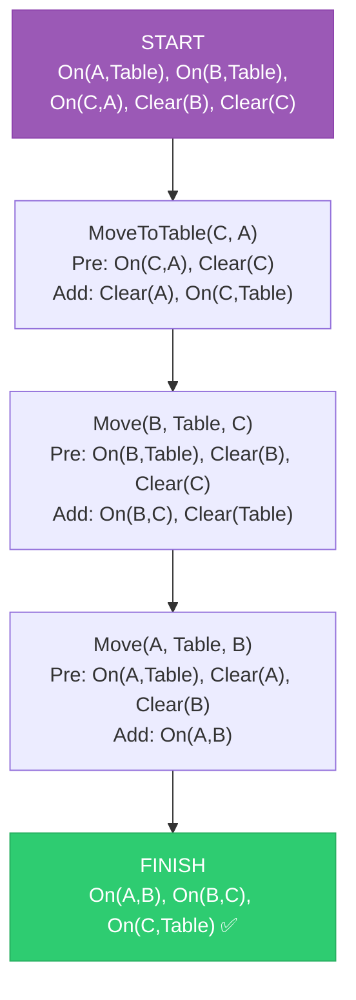

### Comparison: Total Order vs Partial Order Planning

| Parameter | Total Order Planning | Partial Order Planning |
|-----------|---------------------|----------------------|
| **Ordering** | Complete linear order | Only necessary orderings |
| **Flexibility** | Rigid sequence | Flexible — parallel actions possible |
| **Strategy** | State-space search | Plan-space search (least commitment) |
| **Representation** | Linear sequence | DAG (Directed Acyclic Graph) |
| **Sussman Anomaly** | ❌ Fails | ✅ Handles correctly |
| **Complexity** | Simpler to implement | More complex algorithm |
| **Efficiency** | May be suboptimal | More opportunities for optimization |
| **Parallelism** | No parallel actions | Independent actions can be parallel |

---

## Q12) Applications of AI

### Major Application Areas

| # | Application Domain | Description | Examples |
|---|-------------------|-------------|----------|
| 1 | **Game Playing** | AI plays games using search algorithms (Minimax, Alpha-Beta) | Chess (Deep Blue), Go (AlphaGo), Video games |
| 2 | **Expert Systems** | Knowledge-based systems mimicking human experts | MYCIN (medical diagnosis), DENDRAL (chemistry) |
| 3 | **Natural Language Processing** | Understanding and generating human language | ChatGPT, Google Translate, Siri, Alexa |
| 4 | **Computer Vision** | Interpreting visual data from images/videos | Facial recognition, self-driving cars, medical imaging |
| 5 | **Robotics** | Intelligent robots for physical tasks | Industrial robots, surgical robots (Da Vinci), drones |
| 6 | **Machine Learning** | Systems that learn from data and improve over time | Spam filters, recommendation systems (Netflix, YouTube) |
| 7 | **Speech Recognition** | Converting spoken language to text | Google Voice, Siri, Cortana |
| 8 | **Autonomous Vehicles** | Self-driving cars and drones | Tesla Autopilot, Waymo |
| 9 | **Healthcare/Medical AI** | Diagnosis, drug discovery, treatment planning | IBM Watson Health, AI-based X-ray analysis |
| 10 | **Finance** | Fraud detection, algorithmic trading, risk assessment | Credit scoring, stock prediction |
| 11 | **Education** | Personalized learning, intelligent tutoring | Adaptive learning platforms, automated grading |
| 12 | **Cyber Security** | Threat detection, anomaly identification | Intrusive detection systems, malware analysis |

### Diagram — AI Application Categories

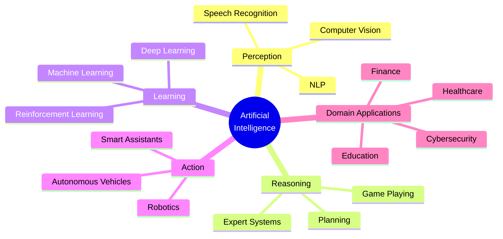

---

## Q13) Natural Language Processing (NLP) — Brief Explanation

### Definition
**Natural Language Processing (NLP)** is a branch of AI that deals with the **interaction between computers and human (natural) languages**. It enables machines to **read, understand, interpret, and generate** human language in a useful way.

### Levels of NLP

| Level | Name | What It Does | Example |
|-------|------|-------------|---------|
| 1 | **Phonological** | Deals with speech sounds | Speech-to-text conversion |
| 2 | **Morphological** | Analyzes word structure (prefix, suffix, root) | "unhappiness" → un + happy + ness |
| 3 | **Lexical** | Word-level analysis, POS tagging | "running" → verb, "fast" → adverb |
| 4 | **Syntactic** | Sentence structure analysis (parsing) | Parse tree: [S [NP The cat] [VP sat]] |
| 5 | **Semantic** | Meaning of words and sentences | "bank" → river bank or financial bank? |
| 6 | **Discourse** | Meaning across sentences/paragraphs | Understanding context across dialogue |
| 7 | **Pragmatic** | Real-world context and intent | "Can you pass the salt?" = request, not question |

### Key NLP Tasks

| Task | Description |
|------|-------------|
| **Tokenization** | Breaking text into words/sentences |
| **POS Tagging** | Identifying parts of speech (noun, verb, adjective) |
| **Named Entity Recognition (NER)** | Identifying names, places, organizations |
| **Sentiment Analysis** | Determining positive/negative/neutral sentiment |
| **Machine Translation** | Translating languages (English → Hindi) |
| **Text Summarization** | Creating concise summaries of larger texts |
| **Question Answering** | Automatically answering questions from text |
| **Information Extraction** | Extracting structured data from unstructured text |

### Diagram — NLP Pipeline

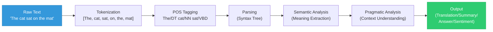

### Applications of NLP
- Google Translate, ChatGPT, Siri/Alexa, Grammarly
- Spam email detection, Sentiment analysis on social media
- Legal document analysis, Medical record analysis

---

## Q14) Types of Learning in AI

### Definition
**Machine Learning** is the study of algorithms that enable computers to **learn from data** and **improve performance** on tasks without being explicitly programmed.

### Classification of Learning Types

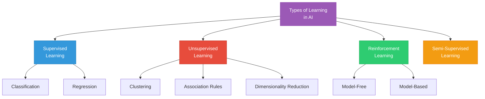

### Detailed Comparison

| Parameter | Supervised Learning | Unsupervised Learning | Reinforcement Learning |
|-----------|--------------------|-----------------------|----------------------|
| **Definition** | Learns from **labeled data** (input-output pairs) | Learns from **unlabeled data** (finds hidden patterns) | Learns through **trial and error** with rewards/penalties |
| **Training Data** | Labeled (with correct answers) | Unlabeled (no correct answers) | No data — learns by interacting with environment |
| **Goal** | Predict output for new input | Discover structure in data | Maximize cumulative reward |
| **Feedback** | Direct (correct answer given) | None | Indirect (reward/penalty after action) |
| **Types** | Classification, Regression | Clustering, Association | Model-free, Model-based |
| **Algorithms** | Decision Tree, SVM, KNN, Neural Networks, Linear Regression | K-Means, DBSCAN, Apriori, PCA | Q-Learning, SARSA, Deep Q-Network |
| **Example** | Email spam detection (spam/not spam) | Customer segmentation | Robot learning to walk |
| **Analogy** | Student learning with a teacher | Student learning by self-exploration | Child learning by trial and error |

### Other Types of Learning

| Type | Description | Example |
|------|-------------|---------|
| **Semi-Supervised** | Uses a mix of labeled and unlabeled data | Web page classification (few labeled, many unlabeled) |
| **Transfer Learning** | Knowledge from one task applied to another | Pre-trained image model fine-tuned for medical images |
| **Active Learning** | Algorithm selects which data to learn from | Model asks human to label most uncertain examples |
| **Ensemble Learning** | Combines multiple models for better accuracy | Random Forest, Boosting, Bagging |
| **Deep Learning** | Uses deep neural networks with many layers | Image recognition (CNN), Language models (Transformers) |
| **Online Learning** | Learns incrementally from streaming data | Stock price prediction with real-time data |

### Key Examples for Each

**Supervised Learning:**
```
Input: Email text → Output: Spam / Not Spam
Input: House features → Output: Price (₹)
Input: Medical report → Output: Disease diagnosis
```

**Unsupervised Learning:**
```
Input: Customer purchase history → Output: Customer segments (groups)
Input: News articles → Output: Topic clusters
Input: High-dimensional data → Output: Reduced features (PCA)
```

**Reinforcement Learning:**
```
Agent: Self-driving car
Environment: Road with traffic
Actions: Accelerate, Brake, Turn
Reward: +1 for staying in lane, -100 for crash
Goal: Learn optimal driving policy
```

---

# 📋 PART C: QUICK REVISION CHEAT SHEET

| Topic | Key Points to Remember |
|-------|----------------------|
| **Alpha-Beta** | α = MAX's best, β = MIN's best. Prune when α ≥ β |
| **FOL** | ∀ uses →, ∃ uses ∧. Predicates have arguments |
| **PL vs FOL** | PL = propositions only; FOL = predicates + quantifiers + variables |
| **Forward Chaining** | Data-driven, bottom-up, fires all matching rules |
| **Backward Chaining** | Goal-driven, top-down, works backward from goal |
| **FC vs BC** | FC = breadth-like, unfocused; BC = depth-like, focused |
| **Resolution** | Proof by contradiction. Convert to CNF → Negate goal → Resolve to □ |
| **CNF Steps** | Eliminate ↔ → Eliminate → → De Morgan's → Skolemize → Distribute ∨ over ∧ |
| **Total Order** | Strict linear sequence of all actions |
| **Partial Order** | Only necessary orderings; allows parallel actions |
| **NLP** | 7 levels: Phonological → Morphological → Lexical → Syntactic → Semantic → Discourse → Pragmatic |
| **Learning** | Supervised (labeled), Unsupervised (unlabeled), Reinforcement (reward) |

---

> [!IMPORTANT]
> ### Last-Minute Exam Tips for MU PT-II:
> 1. **Alpha-Beta & Resolution numericals will definitely come** — practice 3-4 examples each
> 2. **Draw diagrams** for every answer — trees, flowcharts, tables all earn extra marks
> 3. **Use comparison tables** for Q3 and Q6 — examiners love structured answers
> 4. **Number your steps** clearly in algorithmic answers (CNF conversion, chaining)
> 5. **Write definitions first**, then explain, then example — this is the MU marking scheme pattern
> 6. **Time management**: 20 marks in 60 minutes = 3 minutes per mark. Don't spend >15 min on any single question.

---

*Prepared for: MU Sem 6 AI PT-II | Computer Engineering | REV-2019 C-Scheme*  
*Last Updated: March 31, 2026*
